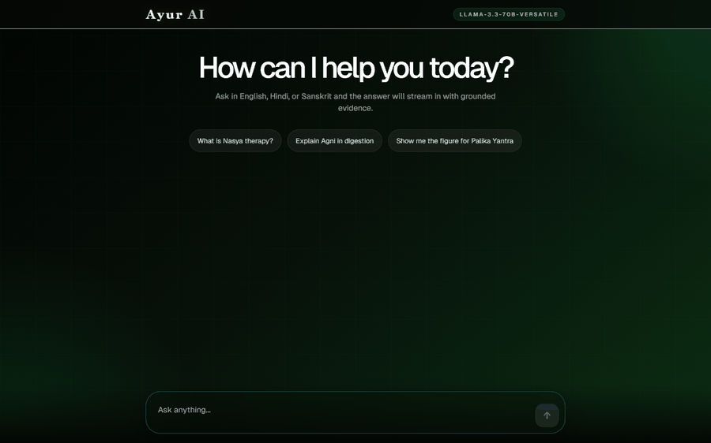
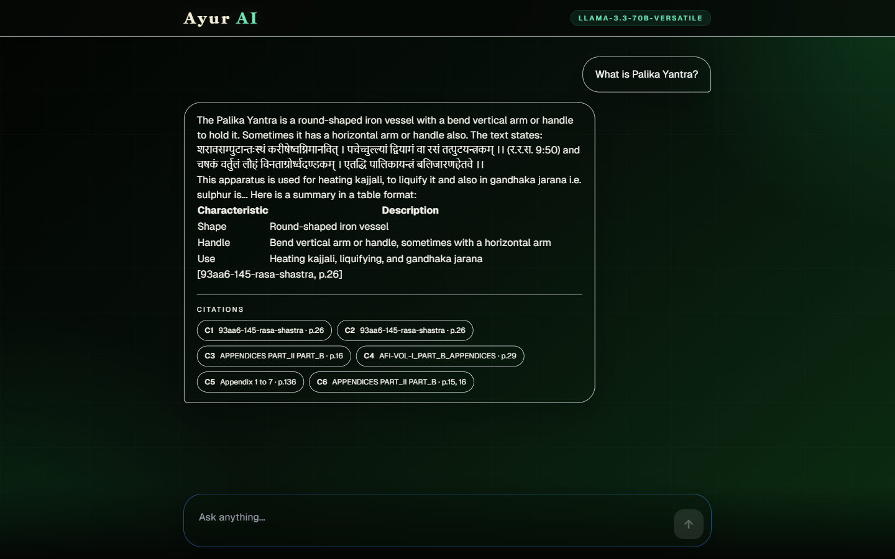
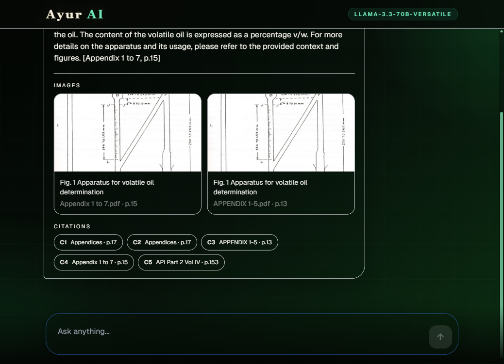
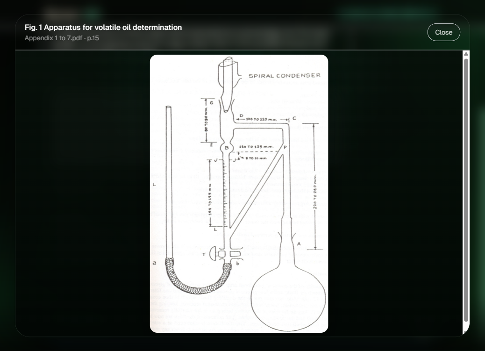
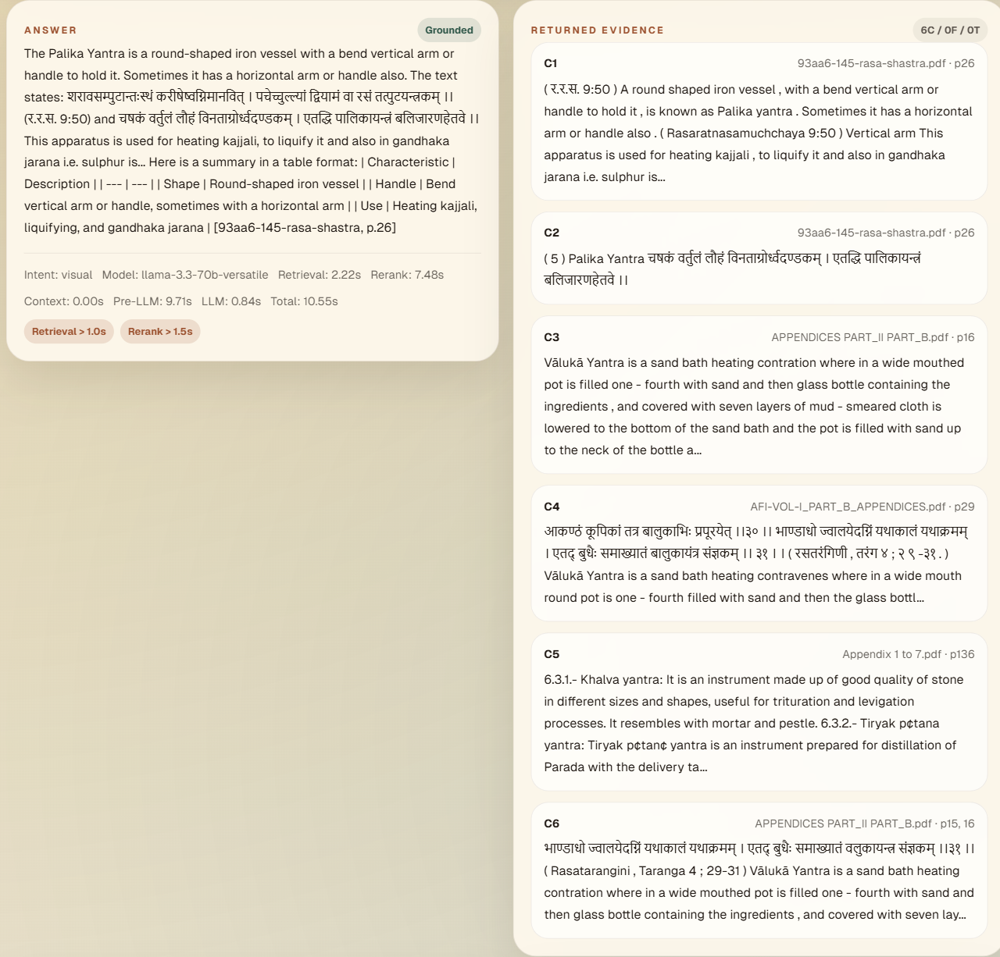
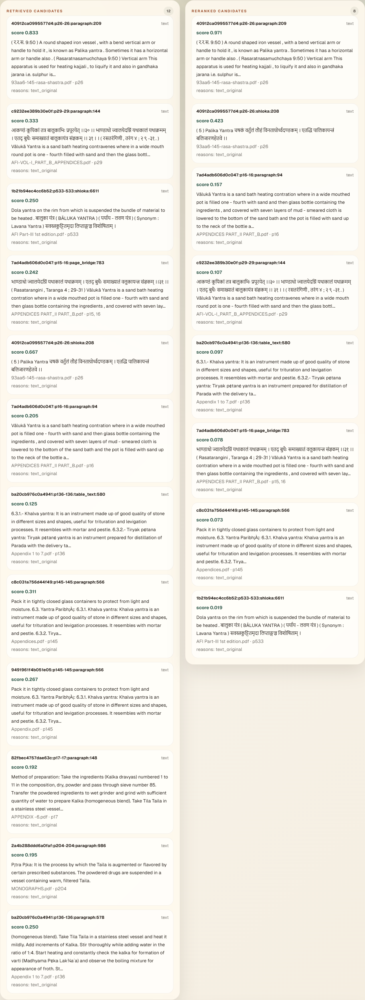
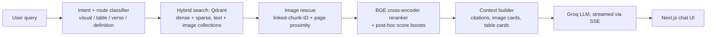
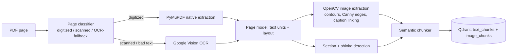

# Ayurveda Multimodal RAG

A grounded, multilingual Retrieval-Augmented Generation system built on top of a real corpus of
scanned and digitized Ayurveda texts — Sanskrit shlokas, Hindi/Telugu commentary, tables, and
hand-drawn diagrams included. It answers in prose, cites its sources by page, and surfaces the
original figure when a question is visual.



## By the numbers

Pulled directly from the current Qdrant collections and ingestion run state — not estimates:

| | |
|---|---|
| **Source PDFs ingested** | 80 |
| **Pages processed** | 9,676 |
| **Page failures** | 0 (100% of pages completed across all 80 documents) |
| **Text chunks indexed** | 58,083 |
| **Sanskrit shlokas isolated as dedicated chunks** | 3,591 |
| **Table-text chunks** | 19,720 |
| **Cross-page "bridge" chunks** (continuity across page breaks) | 2,544 |
| **Diagrams / figures indexed** | 1,134 (1,111 diagrams, 23 tables) |

## Why this exists

Real Ayurveda literature is not clean text. A single PDF can mix native digital text, scanned
pages, multi-column layouts, Devanagari shlokas, English commentary, tables, and diagrams — often
on the same page. Most "PDF to RAG" tutorials assume clean, single-language, single-column input.
This project doesn't: it classifies every page individually and routes it through the pipeline
that actually fits it.

## What it does

- **Page-level document understanding.** Every page is classified as digitized, scanned, or
  OCR-fallback using deterministic text-quality heuristics — mojibake detection, script-mismatch
  scoring, index-page recognition — then routed between native PyMuPDF extraction, Docling, and
  Google Vision OCR accordingly (`backend/ingestion/page_classifier.py`).
- **Computer-vision figure detection.** When a scanned page has no embedded image object, a custom
  OpenCV stage (Otsu thresholding, morphological closing, contour detection, Canny edge-density
  scoring, IoU-based suppression) finds diagram regions directly from the rendered page, then
  geometrically links captions and labels while filtering out logos, QR codes, and decorative
  scan artifacts (`backend/ingestion/image_extractor.py`).
- **Real multilingual and Sanskrit handling.** Script detection across Devanagari, Telugu, Tamil,
  Bengali, and Arabic, shloka (verse) identification via danda-mark and line-symmetry heuristics,
  and an IAST diacritic normalizer that keeps the source text intact while making it
  search-friendly (`backend/normalization/diacritic_normalizer.py`,
  `backend/ingestion/shloka_detector.py`).
- **Hybrid retrieval + reranking.** Dense + sparse hybrid search over Qdrant, query-intent routing
  (visual / table / verse / definition / chitchat) with adaptive fast/deep routes, a BGE
  cross-encoder reranker with score boosting, and image "rescue" via linked-chunk-ID and
  page-proximity fallback so relevant figures surface even when they don't directly match the
  query embedding (`backend/retrieval/hybrid_search.py`, `backend/retrieval/reranker.py`).
- **Streamed, cited answers.** A FastAPI backend streams tokens over SSE from a Groq-hosted LLM,
  grounded in the reranked evidence, and returns structured citations, image cards, and table
  cards alongside the prose (`backend/rag/query_engine.py`).
- **A `/developer` inspector.** A separate debug route replays the full pipeline for any query and
  shows retrieval timings, retrieved vs. reranked candidate order, reranker internals, and the
  exact prompt sent to the LLM — see screenshots below.

## Screenshots

**Grounded answer with a Sanskrit shloka and an auto-generated table**



**Diagram-aware retrieval — the original scanned figure, not a description of it**



**Full-resolution figure lightbox**



**`/developer` view — answer, evidence, and per-stage timings for the same query**



**Retrieved candidates vs. reranked candidates, side by side** — watch the cross-encoder reorder
evidence by actual relevance (score 0.833 → 0.971 for the top match, 0.667 → 0.423 for a
near-duplicate shloka pushed down):



<sub>Full-length `/developer` page (all debug panels, one scroll): 
[`docs/assets/screenshots/05-developer-view.png`](docs/assets/screenshots/05-developer-view.png)</sub>

## How a query flows through the system





## Tech stack

| Layer | Technology |
|---|---|
| Ingestion | PyMuPDF, Docling, OpenCV, Google Vision OCR |
| Embeddings / reranking | BAAI/bge-m3, BAAI/bge-reranker-v2-m3 (sentence-transformers) |
| Vector store | Qdrant (hybrid dense + sparse) |
| LLM | Groq (Llama 3.3 70B) |
| Backend | FastAPI, SSE streaming |
| Frontend | Next.js 14, React, Tailwind CSS |
| Media | Cloudinary |

## Repo At A Glance

- `backend/`: FastAPI API, ingestion pipeline, retrieval/rerank pipeline, Qdrant integration.
- `frontend/`: Next.js app with end-user chat view and `/developer` debug view.
- `backend/data/`: Local data, PDFs, ingestion artifacts (not committed).
- `backend/tests/`: Retrieval/query pipeline tests.

## Main Backend Modules

- `backend/api/main.py`: API entrypoint (`/health`, `/query`, `/query/stream`).
- `backend/ingestion/page_classifier.py`: Deterministic digitized/scanned/OCR-fallback routing.
- `backend/ingestion/image_extractor.py`: Embedded + OpenCV-detected figure extraction and linking.
- `backend/ingestion/shloka_detector.py` / `section_detector.py`: Verse and heading detection.
- `backend/normalization/diacritic_normalizer.py`: Script detection and IAST normalization.
- `backend/retrieval/hybrid_search.py`: Hybrid retrieval + intent routing (`simple`, `fast`, `deep`).
- `backend/retrieval/reranker.py`: Cross-encoder reranker with prewarm and debug timings.
- `backend/rag/query_engine.py`: End-to-end orchestration, sync and streaming.
- `backend/rag/context_builder.py`: Prompt/context assembly from reranked evidence.
- `backend/vector_db/qdrant_client.py`: Qdrant search and point retrieval helpers.

## Prerequisites

- Python 3.11+ (3.12 recommended)
- Node.js 18+
- Access to a Qdrant instance
- Groq API key for answer generation
- For ingestion/OCR/image workflows: Google Vision + Cloudinary credentials

## Backend Setup And Run (Windows PowerShell)

```powershell
cd backend
python -m venv venv
.\venv\Scripts\Activate.ps1
pip install -r requirements.txt
Copy-Item .env.example .env
```

For contributors running tests/local checks, install dev dependencies too:

```powershell
pip install -r requirements-dev.txt
```

Fill required values in `.env` (at minimum: `QDRANT_URL`, `QDRANT_API_KEY`, `GROQ_API_KEY`).
Save the file as plain UTF-8 (no BOM) — a BOM before the first key will silently break
`python-dotenv` key lookup.

Run API:

```powershell
uvicorn api.main:app --host 127.0.0.1 --port 8000
```

Health check:

```powershell
Invoke-RestMethod http://127.0.0.1:8000/health
```

## Frontend Setup And Run

```powershell
cd frontend
npm install
```

Create `frontend/.env.local`:

```bash
NEXT_PUBLIC_API_BASE_URL=http://127.0.0.1:8000
```

Run frontend:

```powershell
npm run dev
```

Open:

- App: `http://localhost:3000`
- Developer view: `http://localhost:3000/developer`

## API Quick Use

`POST /query`

```json
{
	"query": "What is Swedana Yantra?",
	"include_debug": true
}
```

`POST /query/stream` returns SSE tokens + final payload.

## Tests

Backend focused suite:

```powershell
Set-Location d:\Docs\Computer\ayurveda-rag
backend\venv\Scripts\python.exe -m pytest backend/tests/test_retrieval_query_api.py -q
```

Frontend lint:

```powershell
cd frontend
npm run lint
```

## Collaboration Notes

- `backend/requirements.txt` is runtime-only and pinned for reproducibility.
- `backend/requirements-dev.txt` includes runtime + test tooling.
- Avoid committing full `pip list` or `pip freeze` outputs; they include machine-specific transitive
  packages and often create conflicts for collaborators.

## Notes

- If you run `uvicorn ... --reload`, model warmup can appear multiple times because worker
  processes restart on file changes.
- For stable latency checks/manual performance testing, run without `--reload`.
