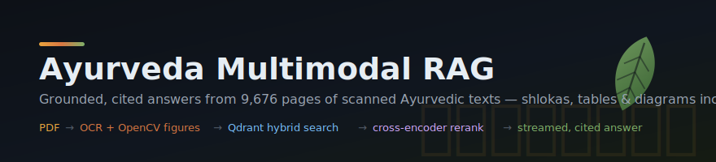
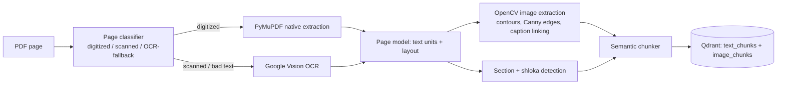

<div align="center">



**Ask a question in English, Hindi, or Sanskrit — get a cited answer grounded in 9,676 pages of real Ayurvedic literature, with the original hand-drawn figure when the question is visual.**


</div>

## What it does

Real Ayurveda literature is hostile input: a single PDF mixes native digital text, scanned pages,
multi-column layouts, Devanagari shlokas, English commentary, tables, and hand-drawn diagrams —
often on the same page. This system ingests that corpus end-to-end and answers questions with
streamed, page-cited evidence. When you ask *"show me the figure for Palika Yantra"*, it returns
the actual scanned diagram, not a text description of one.


The single cleverest idea: **every page is classified individually and routed through the pipeline
that fits it.** Deterministic text-quality heuristics (mojibake density, meaningful-token ratio,
index-page recognition) decide per page between native PyMuPDF extraction, Docling, and Google
Vision OCR — so one book can be half digitized, half scanned, and both halves come out clean.
Downstream, the same philosophy repeats at query time: an intent classifier routes each question
through a fast or deep retrieval path, and an "image rescue" stage pulls in figures by
linked-chunk-ID and page proximity even when they don't match the query embedding directly.

## By the numbers

Pulled from the live Qdrant collections and ingestion run state — not estimates:

| | |
|---|---|
| **Source PDFs ingested** | 80 |
| **Pages processed** | 9,676 — **0 page failures** |
| **Text chunks indexed** | 58,083 |
| **Sanskrit shlokas isolated as dedicated chunks** | 3,591 |
| **Table-text chunks** | 19,720 |
| **Cross-page "bridge" chunks** (continuity across page breaks) | 2,544 |
| **Diagrams / figures indexed** | 1,134 (1,111 diagrams, 23 tables) |

## Highlights

- **Hand-built computer-vision figure detection.** When a scanned page has no embedded image
  object, a custom OpenCV stage (Otsu thresholding, morphological closing, contour detection,
  Canny edge-density scoring, IoU-based suppression) finds diagram regions directly from the
  rendered page, then geometrically links captions and labels while filtering logos, QR codes,
  and scan artifacts.
- **Real multilingual and Sanskrit handling.** Script detection across Devanagari, Telugu, Tamil,
  Bengali, and Arabic; shloka (verse) identification via danda-mark and line-symmetry heuristics;
  an IAST diacritic normalizer that keeps source text intact while making it search-friendly.
- **Hybrid retrieval with a cross-encoder reranker.** Dense + sparse search over two Qdrant
  collections (text + images), query-intent routing (visual / table / verse / definition /
  chitchat), and BGE reranking with post-hoc score boosts — in the demo run below, the reranker
  promotes the scanned Swedana Yantra diagram from mid-pack to #1 for a visual-intent query.
- **Streamed, cited answers.** FastAPI streams tokens over SSE from Groq (Llama 3.3 70B), grounded
  in reranked evidence, with structured citations, image cards, and table cards alongside the prose.
- **A `/developer` inspector built in.** A debug route replays the full pipeline for any query:
  per-stage timings, retrieved-vs-reranked candidate order, and the exact prompt sent to the LLM.
- **Resumable, auditable ingestion.** Per-document run state tracks every page; the full 80-PDF
  corpus completed with zero failed pages.

Here is the retrieval pipeline on a real query, traced end-to-end (`tests/query_debug.py`):


## Architecture

**Query path** — intent-routed hybrid retrieval with image rescue and reranking:


**Ingestion path** — per-page classification and routing:



## Screenshots

| Grounded answer with shloka + auto-generated table | Diagram-aware retrieval |
|---|---|
|  |  |

**`/developer` view — retrieved vs. reranked candidates side by side.** Watch the cross-encoder
reorder evidence by actual relevance (0.833 → 0.971 for the top match; a near-duplicate shloka
pushed down 0.667 → 0.423):


<sub>More: [landing page](docs/assets/screenshots/01-landing.png) ·
[figure lightbox](docs/assets/screenshots/04-image-lightbox.png) ·
[full developer view](docs/assets/screenshots/05-developer-view.png) ·
[developer hero](docs/assets/screenshots/06-developer-hero.png)</sub>

## Quick start

Prerequisites: Python 3.11+ (3.12 recommended), Node.js 18+, a Qdrant instance, a Groq API key.
Google Vision + Cloudinary credentials are only needed for ingestion, not for serving queries.

**Backend** (Windows PowerShell — adapt trivially for bash):

```powershell
cd backend
python -m venv venv
.\venv\Scripts\Activate.ps1
pip install -r requirements.txt          # runtime, pinned
Copy-Item .env.example .env              # then fill QDRANT_URL, QDRANT_API_KEY, GROQ_API_KEY
uvicorn api.main:app --host 127.0.0.1 --port 8000
```

> Save `.env` as plain UTF-8 **without BOM** — a BOM before the first key silently breaks
> `python-dotenv` lookup.

**Frontend:**

```powershell
cd frontend
npm install
echo NEXT_PUBLIC_API_BASE_URL=http://127.0.0.1:8000 > .env.local
npm run dev
```

Open `http://localhost:3000` (chat) and `http://localhost:3000/developer` (pipeline inspector).

**Tests:** `backend\venv\Scripts\python.exe -m pytest backend/tests/test_retrieval_query_api.py -q`
(install `requirements-dev.txt` first) · **Debug one query in the terminal:**
`python tests/query_debug.py --prewarm "your question"`

## API

| Endpoint | Method | Description |
|---|---|---|
| `/health` | GET | Liveness + LLM/Qdrant reachability |
| `/query` | POST | `{"query": "...", "include_debug": true}` → answer, citations, images, tables, timings |
| `/query/stream` | POST | Same, streamed as SSE tokens + final structured payload |

## Project structure

```
backend/
  api/            FastAPI app: /health, /query, /query/stream
  ingestion/      page classifier, OCR pipeline, OpenCV image extractor,
                  shloka/section detectors, semantic chunker, run state
  normalization/  script detection + IAST diacritic normalizer
  embeddings/     bge-m3 text/image embedders (fp16, batched)
  retrieval/      hybrid search, intent routing, cross-encoder reranker
  rag/            query engine orchestration + prompt/context builder
  vector_db/      Qdrant client helpers (search, point retrieval)
  scripts/        corpus ingestion CLI + pipeline inspectors
  tests/          retrieval/query API tests + terminal query debugger
frontend/
  app/            Next.js 14 chat UI + /developer pipeline inspector
```

## Technical notes

<details>
<summary><b>How a page decides its own extraction route</b></summary>

`ingestion/page_classifier.py` scores every page's native text layer before trusting it:
mojibake and weird-symbol density, meaningful-token ratio, Indic-character heuristics,
index-page recognition (dense dot-leader/number patterns), two-column layout detection, and
embedded-image-area ratio. Pages that pass use fast native PyMuPDF
extraction; pages that fail are re-rendered and sent to Google Vision OCR. The decision is
per page, not per document — the common failure mode of scanned-book pipelines (one bad page
poisoning a good book, or vice versa) disappears.
</details>

<details>
<summary><b>Finding figures on pages that have no image objects</b></summary>

Scanned pages are just one big bitmap, so "extract the images" is meaningless. 
`ingestion/image_extractor.py` re-renders the page and runs a CV cascade: Otsu binarization →
morphological closing to merge strokes → contour detection → candidate filtering by area,
aspect, and Canny edge density (diagrams are edge-dense; text blocks and blank regions are not)
→ IoU-based non-maximum suppression to merge overlapping candidates. Surviving regions are
cropped, uploaded to Cloudinary, and geometrically linked to nearby captions and body text so
retrieval can find them by their surrounding language.
</details>

<details>
<summary><b>Why images still surface when embeddings miss them</b></summary>

A figure's embedding often can't match a query like "show me the figure for Palika Yantra" —
the visual embedding knows shapes, not Sanskrit apparatus names. `retrieval/hybrid_search.py`
adds two rescue passes after dense+sparse search: (1) any retrieved text chunk carrying
`linked_ids` pulls its linked figures into the candidate pool, and (2) a page-proximity pass
fetches figures physically near the top text hits. The cross-encoder reranker then scores each
figure by its *linked text*, which is how a scanned diagram can legitimately beat every text
chunk for a visual-intent query (0.453 vs 0.105 in the demo run above).
</details>

<details>
<summary><b>Sanskrit-aware chunking</b></summary>

`ingestion/shloka_detector.py` identifies verse boundaries by danda marks (। ॥), line-length
symmetry, and script runs, so shlokas become dedicated chunks (3,591 in the corpus) instead of
being sliced mid-verse by a token-window chunker. `normalization/diacritic_normalizer.py`
detects scripts per text run and produces an IAST-normalized shadow text for search, while the
original text — diacritics, Devanagari and all — is what gets cited and displayed.
</details>

Natural extensions: table-structure recovery (currently table *text* is indexed, not cell
geometry), a Devanagari-native embedding pass, and multi-turn conversational grounding.

Built to prove that RAG over real-world scanned, multilingual, multimodal literature — not
tutorial-clean text — can be done with zero page failures and a fully inspectable pipeline.
